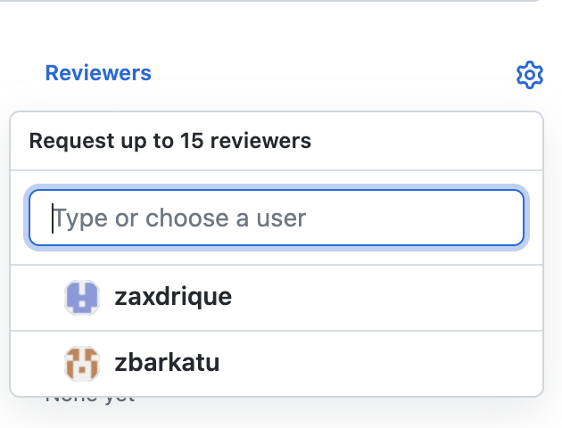

# discoball

Discord bot written with `discord.py` hosted on `Heroku` 

## Getting Started

### Prerequisites
1. Download Python3
1. Download an IDE like
    - **Atom**
    - **Visual Studio Code** (better)
    - **PyCharm** (best)
1. Install virtualenv using `pip install -U virtualenv`

### Setup the project
```
# Create the virtualenv
virtualenv venv        

# Activate the virtualenv
source venv/bin/activate    # Linux / OSX
venv/Scripts/activate.ps1   # Windows powershell

# Install requirements
pip install -r requirements.txt
```

### Run locally
The bot is configured using *Environment Variables*
```
# Setting APP_ENV=production will sync slash commands
[APP_ENV=production] BOT_TOKEN=token python client.py
```

## Next Steps

### Set up linting
- [PyCharm](https://plugins.jetbrains.com/plugin/11084-pylint)
- [Visual Studio Code](https://code.visualstudio.com/docs/python/linting)
- [Atom](https://hackernoon.com/setting-up-atom-as-a-python-ide-a-how-to-guide-o6dd37ff)

### Learn how to run the debugger
- [PyCharm](https://www.jetbrains.com/help/pycharm/debugging-your-first-python-application.html)
- [Visual Studio Code](https://code.visualstudio.com/docs/python/python-tutorial)
- [Atom](https://atom.io/packages/python-debugger)

## How to contribute

### Make a new branch
```bash
# Start from main and make sure you are up to date
git checkout main
git pull

# Create your feature branch
git checkout -b <your_name>
```

### Do some work
```
echo "hello world" > example.txt
git commit -m "Added a file example.txt"
```

### Sync to github
```
git push -u origin <your_name>  # first time only
git push                        # after first time
```

### Create a pull request
[Create PR on Github](https://github.com/Porkbutts/discoball/compare) and compare the branch `<your_name` with `main`. Make sure `main` is the base.

### Request reviews



## Useful reading
- Documentation for [discord-py-slash-command](https://discord-py-slash-command.readthedocs.io/en/latest/)
- Documentation for [discord.py](https://discordpy.readthedocs.io/en/stable/)
- Documentation for [discord apps](https://discord.com/developers/docs/intro)